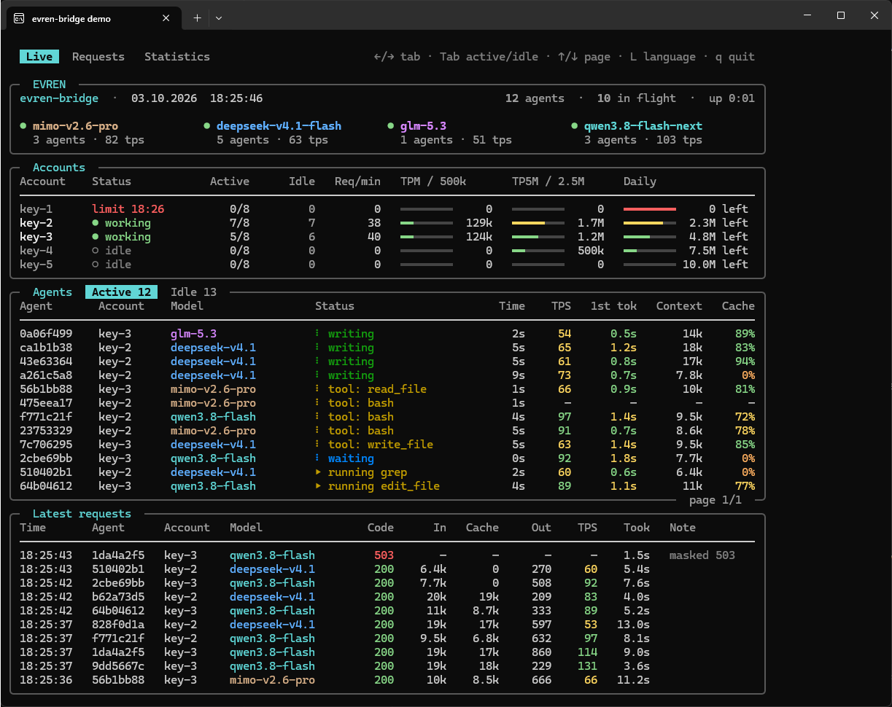
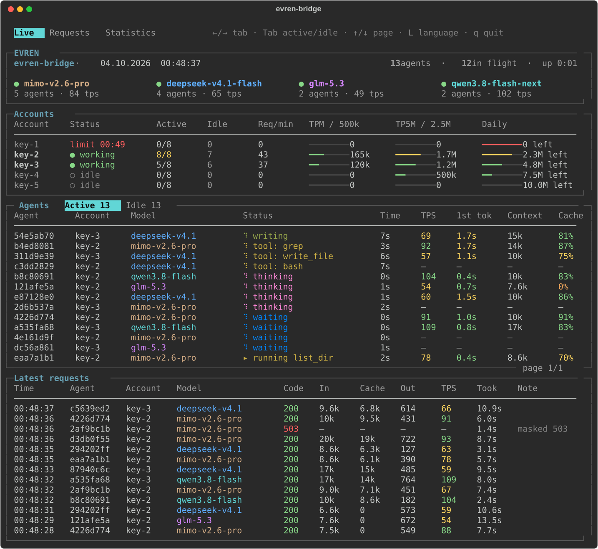
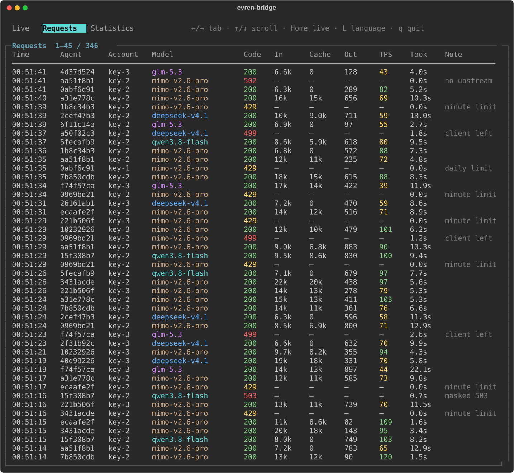
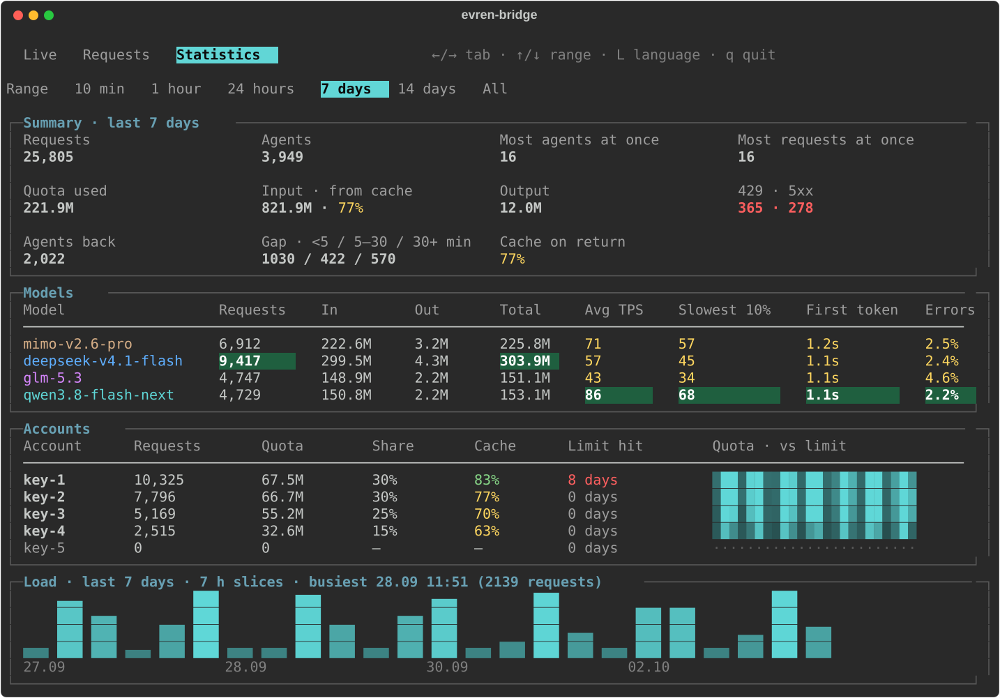

<p align="center">
  
</p>
<h1 align="center">evren-bridge</h1>
<p align="center">
  A local bridge for EVREN: watches every coding agent live and smooths over EVREN's limits and errors.
</p>
<p align="center">
  <a href="LICENSE"></a>
  
  
  <br>
  English · <a href="README.tr.md">Türkçe</a>
</p>

evren-bridge runs on your machine between your coding agents and the LLM service of [EVREN](https://evren.ssyz.org.tr), the Turkish Defence Industry AI Platform. Its terminal panel shows what every agent is doing, how fast it answers, how much of its input came from cache and how much of the day's quota is left.

It also smooths over EVREN's rough edges: a daily-limit refusal comes back with a clear retry time, and errors EVREN hides inside a stream become a normal retry.

It works with other OpenAI Chat Completions providers too. Not an official EVREN project.



## Quick start

You need Python 3.10 or newer (`python3` on macOS and Linux if `python` is missing).

```sh
git clone https://github.com/Kscl1/evren-bridge
cd evren-bridge
python -m pip install -r requirements.txt
```

Put your EVREN API key in `~/.evren/keys.txt` (on Windows `%USERPROFILE%\.evren\keys.txt`), with a label in front:

```text
main=sk-...
```

Start the bridge and leave it running; the panel opens in the same terminal:

```sh
python evren_bridge.py
```

In your agent, add an OpenAI-compatible provider with base URL `http://127.0.0.1:8787/v1` and any API key; the bridge sends your real one.

No key yet? Get one from [EVREN API keys](https://evren.ssyz.org.tr/api-keys).

## Clients

Any agent that speaks OpenAI Chat Completions works. To stay on one key, it must also send a session id. These do:

| Client | Session pinning setup |
|---|---|
|  [Pi](https://github.com/earendil-works/pi) | `sendSessionAffinityHeaders` on each model, see below |
|  [OpenCode](https://github.com/anomalyco/opencode) | Automatic |
|  [Kilo Code](https://github.com/Kilo-Org/kilocode) (OpenCode-based) | Automatic |
|  [Crush](https://github.com/charmbracelet/crush) | Not tested yet |
|  [Goose](https://github.com/aaif-goose/goose) | Not tested yet |

 [Cline](https://github.com/cline/cline),  [Roo Code](https://github.com/RooCodeInc/Roo-Code),  [Continue](https://github.com/continuedev/continue),  [Aider](https://github.com/Aider-AI/aider),  [Zed](https://github.com/zed-industries/zed) and  [Qwen Code](https://github.com/QwenLM/qwen-code) work too, but send no session id, so they are not kept on one key.

<details>
<summary>Pi configuration</summary>

`~/.pi/agent/models.json`:

```json
{
  "providers": {
    "evren-bridge": {
      "baseUrl": "http://127.0.0.1:8787/v1",
      "api": "openai-completions",
      "apiKey": "unused",
      "models": [
        { "id": "glm-5.3", "compat": { "sendSessionAffinityHeaders": true } }
      ]
    }
  }
}
```

```sh
pi --provider evren-bridge --model glm-5.3
```

</details>

Other clients can send `X-Session-Affinity`, `X-Session-Id` or `Agent-Session-Id`. Codex CLI and Claude Code speak other APIs and do not work.

## Configuration

| Option | Default | Purpose |
|---|---|---|
| `--upstream URL` / `EVREN_BRIDGE_UPSTREAM` | `https://evren-llmapi.ssyz.org.tr` | Root URL; request paths are appended |
| `--profile evren\|none` | `evren` without an upstream override, otherwise `none` | Provider-specific rules |
| `--active-cap N` | `20` | Placement threshold for active sessions per key |
| `--lang en\|tr` | `en` | Panel language |
| `--no-panel` | Off | Request log output instead of the panel |
| `EVREN_KEYS_FILE` | `~/.evren/keys.txt` | Keys file |
| `EVREN_BRIDGE_PORT` | `8787` | Local port |

`curl http://127.0.0.1:8787/bridge/quota` shows each key's state and EVREN quota as JSON. The key itself never appears.

## How it works

- An agent is **active** while it waits for an answer or runs a tool it asked for (up to 10 minutes), and **idle** once its turn ends.
- Each agent stays on the key it started on, so EVREN's prompt cache holds for the whole conversation. The bridge remembers that key for 60 minutes; an agent that comes back within that time returns to it.
- A busy key never pushes an agent elsewhere: EVREN's per-minute limit reaches the agent on its own key.
- Without the EVREN profile, answers and errors pass through untouched.

## EVREN profile

On by default. `--upstream` turns it off unless you also pass `--profile evren`.

| EVREN sends | evren-bridge |
|---|---|
| Per-minute limit (429) | Passes it on, with `Retry-After: 60` if EVREN gave none |
| Daily limit (429) | Sets the key aside until its reset |
| An error hidden in a stream that looks successful | Returns 503, so the agent retries |

The panel then also shows per-minute, 5-minute and daily quota, read from EVREN's own counters.

## Panel

| Key | Action |
|---|---|
| `←` / `→` or `1` / `2` / `3` | Switch tabs |
| `Tab` | Live: switch active / idle agents |
| `↑` / `↓`, `PgUp` / `PgDn` | Live: page agents; Requests: scroll; Statistics: change range |
| `Home` | Live: first page; Requests: newest request; Statistics: first range |
| `L` | Switch English / Turkish |
| `q` | Quit |

### Live



### Requests



### Statistics



## Privacy

- Listens on `127.0.0.1` only. Any program on your machine can reach it, and through it your key.
- `logs/bridge.log` keeps, per request: time, key label, path, model, status, token counts, timings and the end of the session id. No keys, no messages, no tool arguments.
- Which agent is on which key lives in memory; a restart starts fresh.

## Development

```sh
python -m unittest
```

The tests run against local fake servers, never the network.

## License

[MIT](LICENSE)
